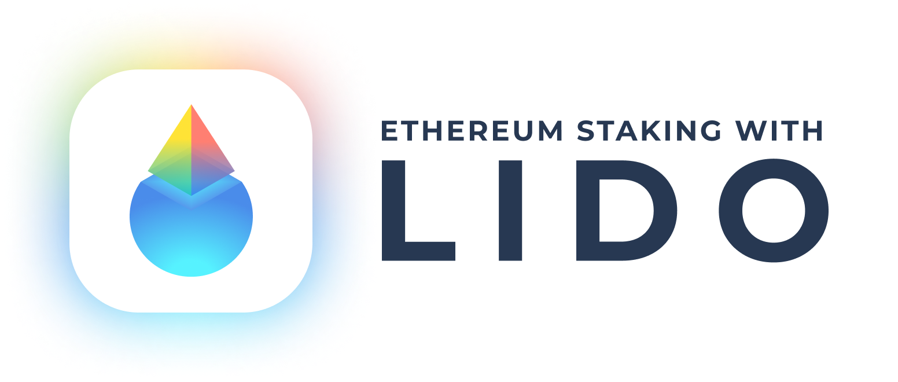

## Disclaimer: WIP!

This repository is currently a **work-in-progress**.

This repository is the modernized iteration of the outdated [`lido-dao` repository](https://github.com/lidofinance/lido-dao). Significant efforts were undertaken to update the tooling and infrastructure to align with current standards and best practices. As part of this modernization process:

- the codebase has been transitioned from JavaScript to TypeScript to leverage TypeScript's robust type-checking, IDE autocompletion, and scalability features;
- the test suite was revamped and restructured to ensure consistent approach and comprehensive testing coverage;
- deprecated dependencies (e.g. Waffle testing framework) were removed or replaced by modern alternatives;
- outdated dependencies such as Hardhat, ethers and others were upgraded to their latest versions to improve performance, compatibility and developer experience;
- Lido Aragon Apps will be migrated to the [Lido Aragon Apps repository](https://github.com/lidofinance/aragon-apps).

---

    
    
    
    
    
    
    
    
     
    
    
    

    

**Lido on Ethereum** is a liquid-staking protocol allowing anyone to earn staking rewards without locking ether or maintaining infrastructure.

Users can deposit ether to the Lido smart contract and receive stETH tokens in return. The smart contract then stakes tokens with the DAO-picked node operators. Users' deposited funds are pooled by the DAO, and node operators never have direct access to the users' assets. Unlike staked ether, the stETH token is free from the limitations associated with a lack of liquidity, and can be transferred at any time. The stETH token balance corresponds to the amount of ether that the holder could request to withdraw.

**NB:** It's advised to read [Documentation](https://docs.lido.fi/) before getting started with this repo.

---

### Key features

- No minimum deposit amount,
- Instant rewards within 24 hours of deposit,
- stETH, an LST with the deepest liquidity in DeFi,
- In-protocol automated withdrawals,
- Governed by Lido DAO.

---

### Learn more

- [Lido DAO governance](https://docs.lido.fi/lido-dao)
- [Technical documentation](https://docs.lido.fi/contracts/lido)
- [Lido addresses](https://docs.lido.fi/deployed-contracts/)
- [Protocol levers](https://docs.lido.fi/guides/protocol-levers/)
- [Audits](https://github.com/lidofinance/audits)

## Bug Bounty

At the moment, the [Lido bug bounty program](https://immunefi.com/bounty/lido/) covers only the contracts in the [Lido DAO repository](https://github.com/lidofinance/lido-dao). Once the work on this repository is finished, the bug bounty program will be updated.

## Contributing

Please refer to the [Lido Contribution Guide](/CONTRIBUTING.md).

## Code of Conduct

Please refer to the [Lido Contributor Code of Conduct](/CODE_OF_CONDUCT.md).

## License

2024 Lido <info@lido.fi>

This program is free software: you can redistribute it and/or modify
it under the terms of the GNU General Public License as published by
the Free Software Foundation, version 3 of the License, or any later version.

This program is distributed in the hope that it will be useful,
but WITHOUT ANY WARRANTY; without even the implied warranty of
MERCHANTABILITY or FITNESS FOR A PARTICULAR PURPOSE. See the
GNU General Public License for more details.

You should have received a copy of the [GNU General Public License](LICENSE)
along with this program. If not, see <https://www.gnu.org/licenses/>.
